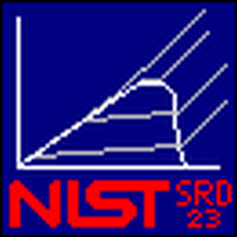

  

    <em>NIST Reference Fluid Thermodynamic and Transport Properties Database (Refprop): Version 11</em>

---

**Documentation**: [https://pages.nist.gov/refprop](https://pages.nist.gov/refprop)

**Purchasing**: [https://www.nist.gov/srd/refprop](https://www.nist.gov/srd/refprop)

---

Refprop is NIST's reference software for calculating the thermodynamic and transport properties of industrially important pure fluids and mixtures, built on validated equations of state and accessible from C++, C, Python, Excel, LabVIEW and MATLAB.

The key features are:

* **Fast**: High-performance C++ core (compiled shared library), with a thread-safe equation-of-state engine enabling concurrent, multi-threaded property evaluations.
* **Accurate**: Properties computed from comprehensive, highly accurate equations of state validated against experimental data across wide ranges of temperature, pressure and composition — the NIST reference standard for fluid property data.
* **Comprehensive**: Covers thermodynamic properties (pressure, density, enthalpy, entropy, heat capacities, Helmholtz energy, phase equilibria, etc.) and transport properties (viscosity, thermal conductivity) for pure fluids and mixtures.
* **Interoperable**: One C++ back end exposed through native C++, a C interface (for Excel, LabVIEW), Python bindings via nanobind (PyPI-distributed, also used transparently by MATLAB), and a Node.js binding for the Electron desktop GUI.
* **Multi-platform**: Runs natively on Windows, Linux and macOS, with a single cross-platform build system and a desktop GUI (Electron) that provides a consistent, OS-native look and feel across all three.
* **Backwards compatible**: Full legacy REFPROP v10 API is preserved alongside new v11 functions, so existing user code keeps working without modification.

---

## Wrappers

* [C](wrappers/c) 
* [C#](wrappers/csharp)
* [C++](wrappers/cpp) 
* [Excel](wrappers/excel)
* [Fortran](wrappers/fortran)
* [LabVIEW](wrappers/labview) 
* [MATLAB](wrappers/matlab) 
* [Mathcad](wrappers/mathcad)
* [Mathematica](wrappers/mathematica)
* [Python](wrappers/python)
* [SWIG](wrappers/swig)

---

## Issues

We invite you to seek assistance with Refprop by submitting an [Issue](https://github.com/usnistgov/refprop/issues). Before submission, please:

* Ensure that you have read the [FAQs](faq.md).
* Be aware that all issues are publicly accessible and viewable. Do not post any code or other content that is protected intellectual property or under copyright.
* Provide a complete working (or non-working) example.
